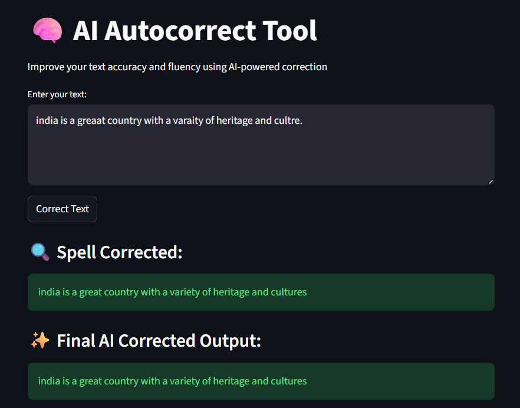

# autocorrect-tool
AI-driven autocorrect tool that improves text accuracy by correcting spelling and grammar using edit distance, word frequency, and NLP. Built with a modular design and deployed via Streamlit, it provides real-time correction and word suggestions through an interactive UI

## Features

* Automatic spelling correction
* Improves text clarity
* Fast and simple user interface
* Interactive web application using Streamlit

---

## Technologies Used

* Python
* Streamlit
* Natural Language Processing (NLP)

---

## Project Structure

autocorrect-tool/
│── autocorrect.py
│── app.py
│── dataset.csv
---

## How It Works

The user enters text in the interface. The system processes the input using NLP techniques and compares it with a dataset or dictionary to detect incorrect words. It then suggests or applies corrections and displays the corrected text.

## Future Improvements

* Add grammar correction
* Support multiple languages
* Improve model accuracy

---

## Author

Pritam Nayak
